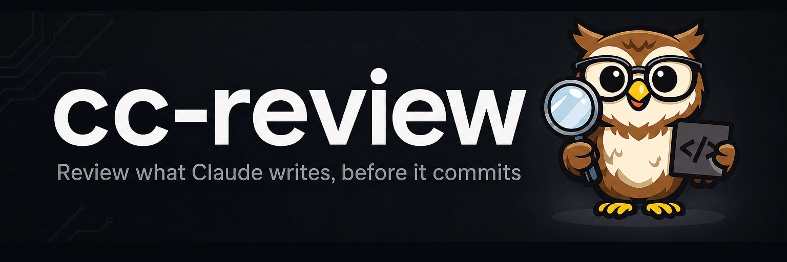

# 

**The only thing between Claude and its next edit is your Submit button.** cc-review renders your working tree as a local PR page and streams your comments to Claude live; a PreToolUse hook freezes edits until you press Submit.

[](https://github.com/yasyf/cc-review/actions/workflows/ci.yml)
[](https://github.com/yasyf/cc-review/releases)
[](LICENSE)

## Get started

```
/plugin marketplace add yasyf/cc-review
/plugin install cc-review@cc-review
```

Then, in a repo where Claude just wrote code, run `/cc-review:start` and open the printed URL:


Driving with an agent? Paste this:

```
/plugin marketplace add yasyf/cc-review
/plugin install cc-review@cc-review
```

<details>
<summary>Standalone CLI, without the plugin (macOS)</summary>

```text
Install the cc-review CLI with `brew install yasyf/tap/cc-review`, then run
`cc-review start` in this repo and give me the review URL to open.
Docs: https://yasyf.github.io/cc-review
```

</details>

---

## Use cases

### Stop a wrong approach before Claude's next edit

Claude just rewrote your handler around a pattern you'd never merge, and it's about to keep going. Start a review:

```
/cc-review:start
```

Claude prints an `http://127.0.0.1:<port>/s/<slug>` URL and the edit guard engages, denying every `Edit` and `Write` until you press Submit. Comment on the offending lines and the rework happens on your terms, not ten files later.

### Answer Claude's clarifying questions on the exact line they're about

In chat, Claude's "which config style do you want" arrives forty lines of scrollback away from the code it's asking about. In the review UI, click the line and say what's wrong:

```text
This hardcodes the rate limit — should it come from config?
```

Claude replies under that comment in realtime, posting a clarifying question, a note, or an ask card with option buttons and a code preview. Pick an option and the answer lands in Claude's session immediately:


### Resume yesterday's review against today's diff

You pressed Submit, Claude applied the feedback, and now you owe round two. Run the same command again:

```
/cc-review:start
```

The review resumes as a new version against the fresh diff. Prior threads carry over, files you already marked reviewed stay marked, and only files whose diff changed come back for re-reading. Everything persists in local SQLite under `~/.cc-review`, and a review idle for 24 hours expires on its own, so an abandoned one never wedges Claude.

## More in the docs

- [The edit guard](https://yasyf.github.io/cc-review/docs/guide/how-a-review-works.html#the-edit-guard) covers what the PreToolUse hook blocks, when it lifts, and why it fails open.
- [Claude's side](https://yasyf.github.io/cc-review/docs/guide/how-a-review-works.html#claudes-side) explains the three kinds of reply Claude posts under your comments.
- [Resume and versions](https://yasyf.github.io/cc-review/docs/guide/how-a-review-works.html#resume-and-versions) traces how reviewed state carries across rounds.
- [CLI reference](https://yasyf.github.io/cc-review/docs/guide/cli-reference.html) lists every `cc-review` subcommand and flag.

Read the [docs](https://yasyf.github.io/cc-review) for the full guide. Licensed under [PolyForm Noncommercial 1.0.0](LICENSE).
