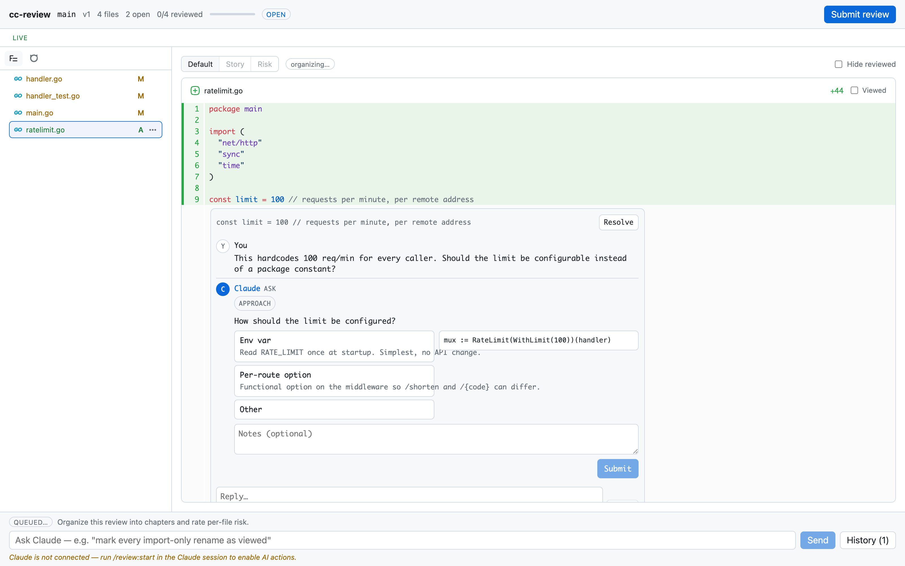

cc-review puts a PR-style review step between Claude writing code and Claude committing to it. You review the uncommitted working tree in a local web UI, Claude responds under your comments in realtime, and a hook blocks further edits until you press Submit.

Here's where you land: a submitted review, in which you commented on Claude's diff from your browser, answered its ask card inline, and pressed Submit — with Claude unable to touch a file until you did. Claude then applies exactly the feedback you froze.

## Requirements

You need Claude Code and a git or jj repository. The prebuilt binary covers macOS (amd64, arm64) and Linux amd64.

## Install

Inside Claude Code, add the marketplace and install the plugin:

```
/plugin marketplace add yasyf/cc-review
/plugin install cc-review@cc-review
```

The plugin is self-contained. On your next session start, a SessionStart hook downloads the prebuilt `cc-review` binary from the GitHub release matching the plugin version. There is no Go toolchain or build step on your machine. When the plugin updates, the hook replaces the binary so the two stay in lockstep.

To install the `cc-review` CLI on its own (macOS), use Homebrew:

```
brew install yasyf/tap/cc-review
```

## Run on a Linux host

Have the workspace start `cc-review supervise` as a long-lived foreground process and restart it if it exits. Set the daemon's environment on that process. For a remote VM, `CC_REVIEW_HTTP_PORT` pins its loopback HTTP port; `CC_REVIEW_URL` sets the origin of printed review URLs, without a trailing slash. Start the supervisor on the VM:

```sh
CC_REVIEW_HTTP_PORT=7392 CC_REVIEW_URL=http://127.0.0.1:17392 cc-review supervise
```

On your desktop, forward port 17392 to the VM's port 7392, replacing `vm.example.com` with your host:

```sh
ssh -N -L 127.0.0.1:17392:127.0.0.1:7392 vm.example.com
```

Keep both processes running, then run `cc-review start` on the VM and open its printed URL in your desktop or Orca browser. Without the supervisor, CLI commands fail and hooks silently skip their work.

::: {.callout-warning title="Same-user trust"}
Linux trusts every process with the same user ID, so any process running as you can impersonate the daemon. Use this only on private single-user VMs.
:::

## Your first review

1. Have Claude make some changes. Ask it to fix a bug or add a small feature, and stop before it commits.

2. Start the review:

   ```
   /cc-review:start
   ```

::: {.callout-tip title="Checkpoint"}
Claude prints a review URL of the form `http://127.0.0.1:<port>/s/<slug>` and tells you it is watching for comments. If `start` says `no changes to review`, see [Nothing to review?](#nothing-to-review).
:::

3. Open the URL in your browser. You get a familiar PR layout with a file tree on the left, syntax-highlighted diffs of the uncommitted working tree, and a header with the version, file count, review progress, and a Submit button.

4. Click a line in the diff and leave an inline comment, the same kind you would write on any PR. It streams to Claude immediately.

5. Watch the thread. Claude reads the surrounding code and replies under your comment in the review UI, not in the chat window. A reply can be a clarifying question, a note, or an "ask", which renders as a structured card with option buttons, an optional code preview, and a notes field. Pick an option (or write your own) and submit the card; your answer goes straight back to Claude.

   

::: {.callout-tip title="Checkpoint"}
Claude's reply renders under your comment in the browser, and while the review is open every edit is denied — a PreToolUse hook holds `Edit`, `Write`, and `NotebookEdit` until you submit. `cc-review list` shows the review as an `open` row.
:::

6. When you have said everything you want to say, press **Submit**. This freezes the feedback. Claude reads the full set of threads, asks you about any questions you left unanswered in the UI, and then applies the feedback to the code.

7. After Claude makes the changes, run `/cc-review:start` again. It resumes the same review as a new version against the new diff, with all prior history retained.

A review idle for 24 hours expires on its own and unblocks edits; `cc-review close` ends one without submitting, and `cc-review list` shows every open review.

## Nothing to review?

In a git repo with uncommitted work, the diff is that work against `HEAD`, covering tracked, staged, and untracked files but skipping ignored ones. With a clean tree, it's the whole branch against its fork point from trunk, so work Claude already committed on a feature branch still shows up. `start --base <ref>` pins any other base. In a jj repo, it snapshots the working-copy change (`@`) against its parent.

The diff comes up empty only when there's nothing on either side: a clean tree on trunk itself. Have Claude make its change on a branch, or leave it uncommitted, and start again.

## Next

Read [How a review works](how-a-review-works.md) for the full lifecycle, from events and replies to the edit guard and resume semantics. To review a GitHub pull request with comments synced both ways, see [Reviewing pull requests](pull-requests.md).
