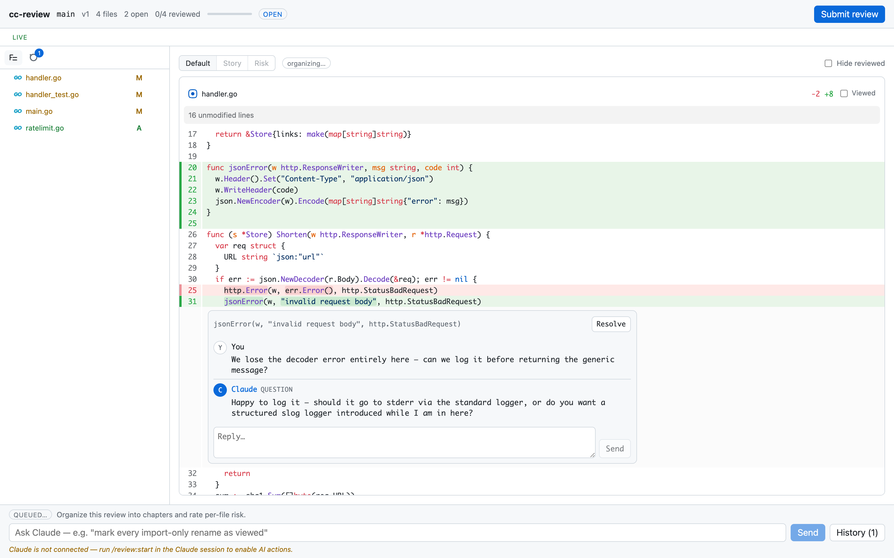
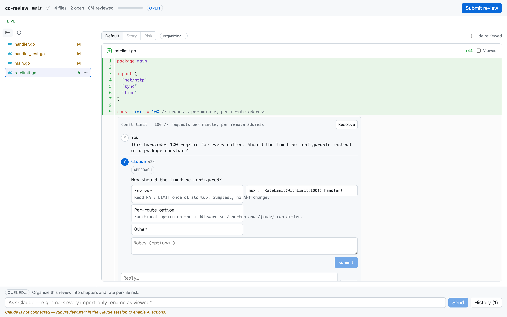

A review is a conversation about a diff that hasn't been committed yet. You ask Claude to start one, read its uncommitted changes in a browser, leave inline comments, and press Submit. Claude watches the whole time but cannot edit anything until you do. This page explains each phase of that lifecycle and why it works the way it does.

## The snapshot

When Claude runs `cc-review start`, the daemon captures the state of your working tree as a patch. In a git repo, that means everything uncommitted, including tracked, staged, and untracked files but excluding ignored ones, diffed against `HEAD`. A repo with no commits is diffed against the empty tree. In a jj repo, including a colocated one, it diffs the working-copy change (`@`) against its parent.

In a [Graphite](https://graphite.dev)-tracked repo, the snapshot is a stack rather than a single diff. The daemon reads Graphite's branch metadata and the review becomes ordered sections: one per stacked branch, each diffed against its parent, trunk-most first, with the uncommitted working tree as a final pending section. You read the stack the way stacked PRs are meant to be read — each section building on the one before it — and the section a comment lands on travels with the comment. A plain repo is the one-section case of the same model.

The patch is stored as a numbered version inside the review, in SQLite under `~/.cc-review/v1`. The web UI renders that frozen patch, not the live filesystem, so the diff you're reading stays stable even if files change underneath it. Each later round of review captures a new version of the same review, and the history of every version is retained.

If there are no uncommitted changes — and, in a stack review, every stacked branch is empty too — the diff is empty and there is nothing to review.

## Commenting

The review page looks like a pull request, with a file tree on the left, syntax-highlighted diffs on the right, and a header showing the version number, file progress, and the Submit button.

You comment by selecting lines in the diff, the same gesture as on GitHub. Each comment is anchored to a file path and a line range on a specific side of the diff — and, in a stack review, to the section it sits in — and it starts a thread. As you work through files, you can mark each one reviewed; the daemon remembers which files you've cleared.

Every comment streams to Claude's session the moment you post it. The daemon pushes events over a localhost connection, and Claude's session receives each one as a notification, with no batching and no polling on your side.

## Claude's side

While the review is open, Claude is in a read-only posture. It receives each comment as an event, reads the referenced file for context, and may post a reply under your comment. Replies render in the thread in realtime, and they come in three kinds. A `question` is a free-text clarifying question, used when your comment is ambiguous. An `ask` is a structured card with a header and option buttons, the in-review equivalent of Claude's `AskUserQuestion`; each option can carry a description and a code or markdown preview. A `clarification` is a note with no question attached, such as pointing out that a change would ripple into other callers.

You can answer an ask directly in the web UI by picking an option, optionally adding notes, and submitting the card. That answer travels back to Claude immediately as an update to the thread, so the question is settled before you ever press Submit. Questions you skip become the open questions that Claude drains after submit, surfaced in the terminal via `AskUserQuestion`, with your picks written back into the review record.

Claude makes no code changes in this phase, by instruction and by enforcement. The edit guard described below blocks any attempt.

## Submit

Pressing Submit ends the round. The review's status becomes `submitted`, and your feedback is frozen as a JSON document with two parts. `threads` holds every comment with its full back-and-forth, and `open_questions` holds the questions Claude raised that you didn't answer in the UI.

Claude reads that document with `cc-review feedback`, asks you each open question in the terminal, records your answers, and only then starts editing. The freeze matters because the feedback Claude acts on is exactly the set of threads you saw when you pressed the button, not a moving target. In a stack review, every thread carries the branch that owns it, which is what lets Claude apply each fix on the owning branch — `gt modify` on a mid-stack branch — instead of piling everything onto the top.

## Resume and versions

After Claude applies your feedback, run `/cc-review:start` again. It resumes the same review as a new version, with a fresh snapshot, a clean comment slate against the new diff, and all prior versions and threads retained underneath. Resume follows the Claude window. It survives `/clear` and session resume in the same window, and it doesn't key on the branch, so a mid-review checkout won't fork it.

Reviewed state carries forward between versions. Files you already marked reviewed stay marked; the daemon unmarks only the files whose diff actually changed since the last version, so a second round means re-reading the delta, not the whole change.

A stack review re-resolves the whole stack on every round. A restack that changes no content reuses the version outright, so your comments stay put; an amended branch produces a new version, and only the changed sections' files come back unreviewed.

When you want to start over instead, `cc-review start --new` detaches the existing review and creates a fresh one.

## The edit guard

The plugin registers a PreToolUse hook on `Edit`, `Write`, and `NotebookEdit`. Before any of those tools run, the hook calls `cc-review guard-edit`, which denies the edit while a review for the session is open and awaiting feedback. Once you press Submit, the guard lifts.

The guard also lifts on its own. An open review idle for 24 hours expires: edits unblock, `/clear` no longer resumes it, and an explicit `/cc-review:start` reopens it. Idle means no comments, replies, AI-bar activity, or new versions; presence pings don't count. To end a review immediately without submitting, press **Close without submitting** in the web UI or run `cc-review close [review]` — the current window's review by default, or any review by slug or id. `cc-review list` shows every open or expired review with its status, age, idle time, and repo, and `cc-review close --stale` closes every expired review across repos. Alongside `open` and `submitted`, a review's status can be `expired` or `closed`.

The guard fails open. If the cc-review binary or daemon is unavailable, edits are allowed. A review tool that could brick Claude's ability to write files when its daemon dies would be worse than one round of unreviewed edits.

## Claude's side of the protocol

Everything Claude does during a review, from wiring up event delivery to the event schema and the reply commands, is specified in the `/cc-review:start` skill that ships with the plugin. The [skill source](https://github.com/yasyf/cc-review/tree/main/plugin/skills/start) is the operator's source of truth for that protocol. For the human-facing commands, see the [CLI reference](cli-reference.md).
